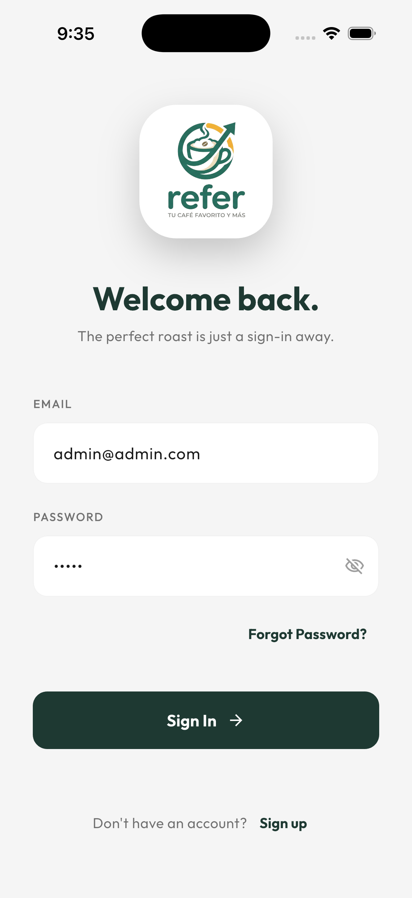
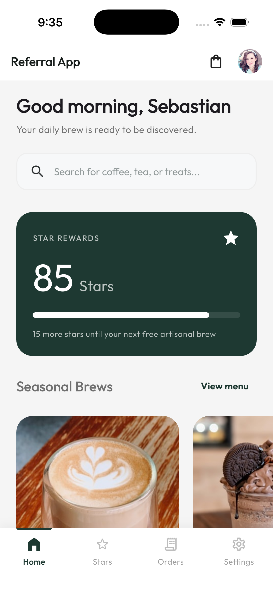
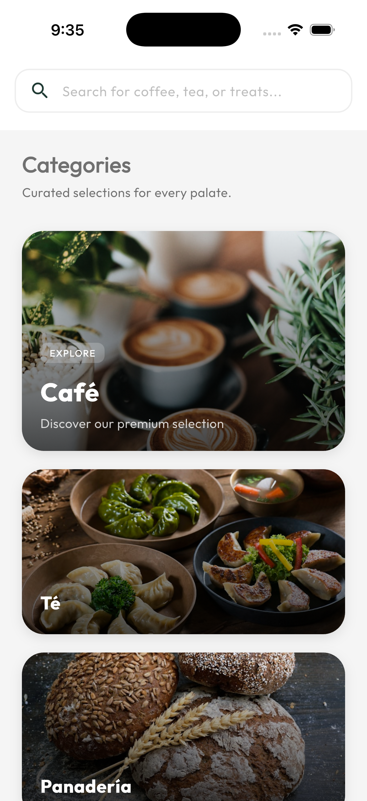
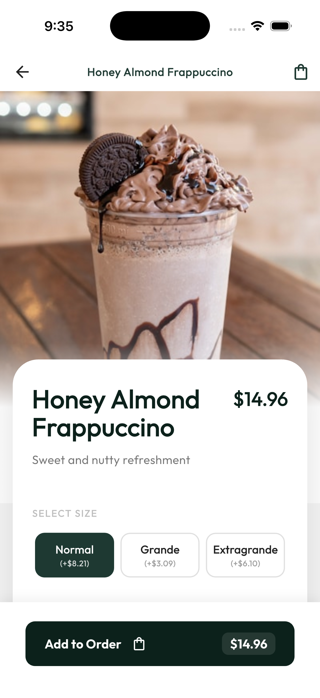
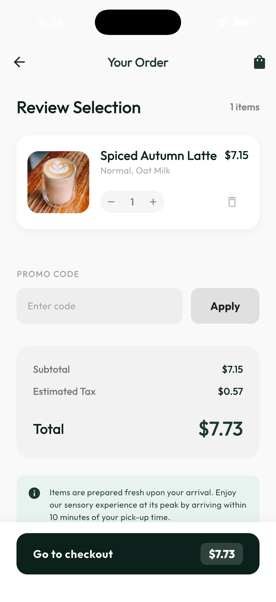
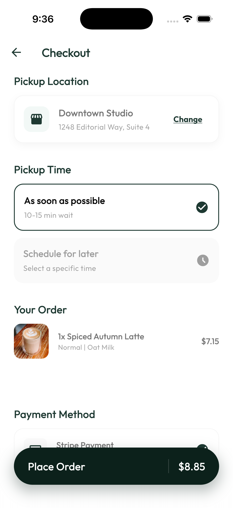

# Refer App — Artisan Espresso ☕✨

[](https://flutter.dev/)
[](https://pub.dev/packages/flutter_bloc)

**Refer App** es una plataforma premium de pedidos de café artesanal diseñada para ofrecer una experiencia sensorial única. Desde la selección de granos exclusivos hasta un sistema de recompensas basado en "estrellas", la aplicación combina un diseño sofisticado con una funcionalidad robusta.

---

## 📸 Capturas de Pantalla

<div align="center">
  
  
  
  <br/><br/>
  
  
  
</div>

---

## 🚀 Características Principales

- **Autenticación Segura**: Inicio de sesión clásico y social (Google/Apple).
- **Catálogo Premium**: Explora cafés de temporada, té, panadería y mercancía exclusiva.
- **Personalización Detallada**: Configura tu bebida ideal (tamaño, tipo de leche, shots de espresso extra).
- **Sistema de Recompensas (Stars)**: Acumula estrellas con cada compra y canjéalas por productos gratuitos.
- **Gestión de Pedidos en Tiempo Real**: Seguimiento desde la preparación ("Infusionando") hasta la entrega.
- **Pagos Integrados**: Pagos rápidos y seguros mediante Stripe.
- **Multi-idioma**: Soporte completo para Español e Inglés.

---

## 🛠️ Stack Tecnológico

La aplicación está construida siguiendo los más altos estándares de desarrollo en Flutter:

*   **Arquitectura**: Clean Architecture orientada a características (Features).
*   **Gestión de Estado**: [Flutter BLoC](https://pub.dev/packages/flutter_bloc).
*   **Navegación**: [GoRouter](https://pub.dev/packages/go_router).
*   **Inyección de Dependencias**: [GetIt](https://pub.dev/packages/get_it) & [Injectable](https://pub.dev/packages/injectable).
*   **Networking**: [Dio](https://pub.dev/packages/dio) con interceptores para logging y seguridad.
*   **Real-time**: [Socket.io Client](https://pub.dev/packages/socket_io_client) para actualizaciones de estado de pedidos.
*   **Persistencia**: [Shared Preferences](https://pub.dev/packages/shared_preferences) & [Flutter Secure Storage](https://pub.dev/packages/flutter_secure_storage).
*   **UI/UX**: Google Fonts, Flutter SVG, Syncfusion Gauges y animaciones Shimmer.

---

## 📦 Instalación y Configuración

### Requisitos Previos

*   [Flutter SDK](https://docs.flutter.dev/get-started/install) (v3.9.2 recomendada).
*   [FVM](https://fvm.app/) (opcional, pero recomendado ya que el proyecto incluye configuración `.fvm`).
*   Dart SDK configurado.

### Pasos para Ejecutar

1.  **Clonar el repositorio:**
    ```bash
    git clone https://github.com/cobyzero-org/refer_app.git
    cd refer_app
    ```

2.  **Instalar dependencias:**
    ```bash
    flutter pub get
    # O si usas FVM:
    fvm flutter pub get
    ```

3.  **Generar código necesario (Freezed, Injectable, etc.):**
    ```bash
    flutter pub run build_runner build --delete-conflicting-outputs
    ```

4.  **Ejecutar la aplicación:**
    ```bash
    flutter run
    ```

---

## 📁 Estructura del Proyecto

El proyecto sigue una estructura modular para facilitar la escalabilidad:

```text
lib/
├── core/           # Componentes compartidos, constantes, temas y utilidades.
├── features/       # Módulos de la aplicación:
│   ├── auth/       # Registro e inicio de sesión.
│   ├── home/       # Dashboard principal y categorías.
│   ├── stars/      # Sistema de recompensas y beneficios.
│   ├── orders/     # Historial y seguimiento de pedidos.
│   └── ...         # Otros módulos funcionales.
├── l10n/           # Archivos de localización (i18n).
└── main.dart       # Punto de entrada de la aplicación.
```

---

## 🎨 Diseño y UX

La aplicación utiliza la **Serie Sensory Roast** como base visual, enfocándose en:
- Tipografía moderna (Google Fonts).
- Micro-interacciones suaves.
- Estados de carga elegantes con Shimmer.
- Feedback visual constante para el usuario.

---

## 📝 Licencia

Este proyecto está bajo la Licencia MIT. Consulta el archivo `LICENSE` para más detalles.

---
Desarrollado con ❤️ por el equipo de **Refer App**.
